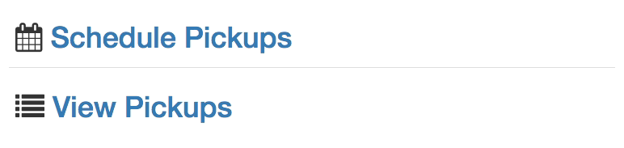
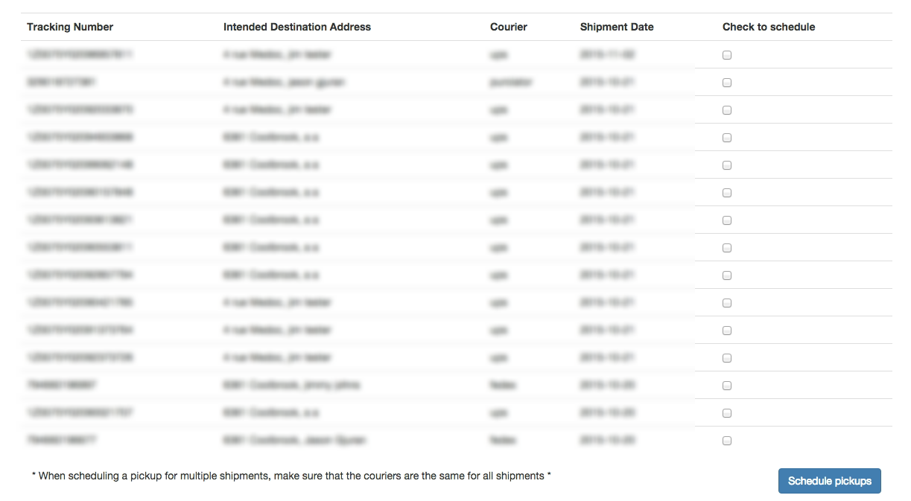

# Smartship Shopify App (BETA)

- [Features](#features)
- [Limitations](#limitations)
- [Installation](#installation) 
- [Report Issues](https://github.com/flagshipcompany/shopify-issues/issues)
- [Getting Started With the Smartship app](#getting-started-with-the-smartship-app)
- [Smartship app settings](#smartship-app-settings)
- [Smartship Pending Orders](#smartship-pending-orders)
- [Smartship Prepared Orders](#smartship-prepared-orders)
- [Schedule Pickups](#schedule-pickups)
- [Pickup Form](#pickup-form)
- [View Pickups](#view-pickups)

##Features
* Get realtime discounted rates from Smartship with your Smartship Account
* Print your labels from the app
* Manage pickups from the app
* Split the shipment in several boxes depending on weight
* Push any order to Smartship to create a prequoted shipment (useful if you don't have realtime quoting available in your Shopify Plan)
* Easy way of adding residential surcharges to the quoted price

##Limitations
 * Only "Unlimited" shopify plans will benefits from real time quoting. Shops with a lesser plan will still be able to send shipment information to Smartship automatically.
 * Since Shopify does not provide dimensions of your store goods, the rating is made by weight only. Make sure you enter the dim weight for your goods if necessary for large but light items.
##Installation
### Create Credentials
Go to https://auth.smartship.io and create a set of credentials using the Shopify Preset
*NOTE: Only Account Manager can access the credentials page*

**copy** or keep this page open, as we will need some information from this `token` that was created.

### Install the App
#### BETA installation

You need to create copy paste this link in your browser, while replacing the name of your shop:

`https://shopify.smartship.io/remote-install?shop=MY_SHOP_NAME.myshopify.com`

You need to replace `MY_SHOP_NAME` with the actual name of your shop, e.g 
if the name of your shop is `awesomecandies.myshopify.com` you need to go to this address:
`https://shopify.smartship.io/remote-install?shop=awesomecandies.myshopify.com`

*NOTE: One we're out of beta, the app will be available in the Shopify App Store*

Accept the permissions it needs and you're almost done! 

## Connecting the app to the Smartship API

When the app is installed, you will be taken to this page where you register your token to the app.

Insert your **Public** and **Private** keys from the token that we created earlier into the appropriate fields.

There is a link to the page where you create your credentials in this page in case you missed [this](#create-credentials) step or forgot your credentials for this token.

Submit the keys by pressing the **Save token credentials** button. If the key pair is valid, you have successfully linked your app to the Smartship API.

You now have full access to the Smartship app.

If for any reason, your token gets deleted, you will be redirected to this page if you ever access the app, as your token does not exist and is not considered valid. You will need to create a new token if you wish to continue using the app.

## Getting Started With the Smartship app
Here are the menu options that can be done in the app

* **Pending Orders**
Allows you to complete orders using Smartship and dispatch them
* **Prepared Orders**
Allows you to view dispatched shipments, request documents and view the shipment overview (done on the Smartship site)
* **Pickups**
Allows you to schedule pickups for dispatched shipments, view pickups and cancel scheduled pickups
* **Settings**
Change app settings that modify quoting and shipment options when dispatching using Smartship.

### Smartship App Settings

* **Services**
Checkboxes consisting of the courier services that Smartship offers, and a list of the various services types that the couriers will offer. You can use these checkboxes to show or hide certain couriers or services so that they will not appear to in the *shipping method* menu at checkout

* **Packaging**
Allows you to set a weight limit split on individual boxes in orders, meaning that if you have an order which would exceed the weight that you provided, the app adds an extra box during the quoting and dispatch processes.

* **Additional Charges**
Allows you to add a residential surcharge during the quoting process and dispatch process. This helps get more accurate rates during the quoting process and the dispatch process. You can also choose to insure orders that are made through your store.

### Smartship Pending Orders

This is the page where you can see all the orders that have been placed by customers. 

This page also allows you to take orders and convert them to a shipment using the Smartship system. You an also automatically dispatch orders from this page as well, provided the order was quoted with a Smartship service.

Upon installing the app, it will fetch all the orders you your store has not marked as shipped from the past thirty days and add them to the app's records so that you can start using the Smartship app right away.

* **Order Number**
The order number as it appears in your shopify admin store. Links to the overview for the order in you shopify admin page.

* **Order Date**
The date the order was placed on.

* **Courier Used**
The courier used or the company who provides the shipping service (ex: Ups, Fedex, Shopify, etc.).

* **Service Used**
The shipping service selected by the customer.

* **Quoted Price**
The price that was displayed to the customer at the shipping method page in your storefront.

* **Is Fufilled**
Checks to see if the order has been fufilled in your admin page. An order is considered fufilled by the app when you mark the order as having been fully paid in your shopify admin page.

#### Smartship actions
An action that can be taken for the order, usually in the form of a button or a link. Different factors will determine what will be shown and what actions it will take.
  
* **Convert order to Smartship**

An order that has not been given a service provided by Smartship can be sent to Smartship and it will create a prequoted shipment that you can then complete on the Smartship website. Note you **will not** be charged for completing this action. However, should you dispatch this order through the Smartship website, you **will** be charged for this order.

* **Dispatch Order to Smartship**

An order that has a shipping method provided by Smartship can be immediately created and dispatched to Smartship. This action will create the appropriate documents necessary to send your shipment to the customer. If your order has been fufilled in you store's admin page, a prompt will appear asking you to confirm the dispatch. It's just a bit of extra confirmation to make sure you don't dispatch an order that has already been sent out so that you don't get charged for an order that you do not plan on shipping. Note that by dispatching an order using the app, you **will** be charged for the dispatched order on Smartship.

* **View on Smartship**

Allows you to either see the overview for your order or continue the quoting process on the Smartship website. If your order was prequoted using the app, the link will bring you to the quote page for your order on the Smartship site. If the order was dispatched using the app, then the link will be the same, but will instead take you to the shipment overview page for the order on the Smartship site.

### Smartship Prepared Orders
This allows you to see all the orders you have dispatched using the Smartship app and website.

* **Order Number**
The order number as it appears in your shopify admin store. Links to the overview for the order in you shopify admin page.

* **Tracking Number**
The tracking number for the order.

* **To Address**
The destination of the order, as well as its intended receiver, either a company name or the name of a person.

* **Service Used**
The service that was used when the order was dispatched. 

* **Total Cost**
The total cost that was quoted when the order was dispatched.

* **Shipping Documents**

The list of shipping documents that are required when dispatching your order to the couriers. Every dispatched shipment will a link to the regular sized label and a thermal sized label. These labels must be placed on each of the packages in your shipment. For international shipments, there is a commercial invoice document that must also be included in the shipment along with the shipping labels. All the documents are in .PDF format.

* **View On Smartship**
Bring you to the overview page for the shipment on the Smartship website.

###Pickups
This link will bring you to the pickup actions page. From here, you can navigate to the **Schedule Pickups** page, or the **View Pickups** page.

####Schedule Pickups
From this page, you can schedule pickups for the shipments you made from Smartship.

* **Tracking Number**
The tracking number for the order.

* **Intended Destination Address**
The destination of the order, as well as its intended receiver, either a company name or the name of a person.

* **Courier**
The courier company which was used in the dispatch.

* **Shipment Date**
The date on which the shipment was made

* **Check To Schedule**
Checkboxes for which you want to schedule pickups for. You can schedule a single pickup for multiple shipments, provided they are all from the same courier. If the couriers are all the same for the selected shipments, you can then proceed to the schedule pickup page by pressing the Schedule pickups button on the bottom right of the page.

####Pickup Form
This is where you fill the information for your pickup. All of the fields are required to schedule your pickup.

* **Pickup address**
This is the address that will be used for the pickup address. This is your store's address information.

* **Pickup Date**
The date when you want to schedule the pickup. Note that all the couriers have different lengths for which you can schedule your pickups ahead of time. In most case, scheduling pickups more than a week ahead of time may result in the request failing.

* **Pickup Location**
A drop down list of pickup locations that are considered valid options by the courier.

* **Delivery Instructions**
Special instructions to the driver for how to handle your shipment or other relevant information

Once all the information has been filled in. You can proceed by pressing the Schedule button. Once that has been done and no errors occur, your pickup is created and you can now view it from the **View Pickups** page.

####View Pickups
This is where you can view all the pickups you have made on Smartship. You can also cancel pickups you have already made.

* **Confirmation number**
The pickup confirmation number.

* **Pickup Date**
The date when the pickup was made for.

* **Pickup Location**
The location that was provided when the pickup was scheduled.

The next row can have a button that allows you to cancel the pickup, provided that either the pickup has not been picked up by the courier yet, or that the pickup date has not been passed.

Cancelled pickups will have the row highlighted in red and the cancel button is removed.
