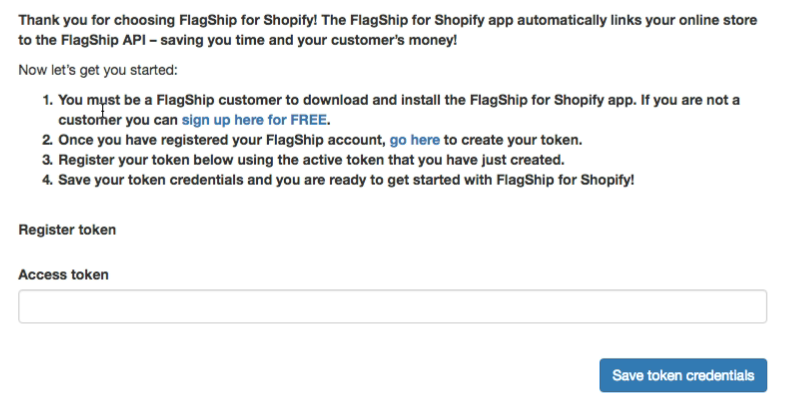
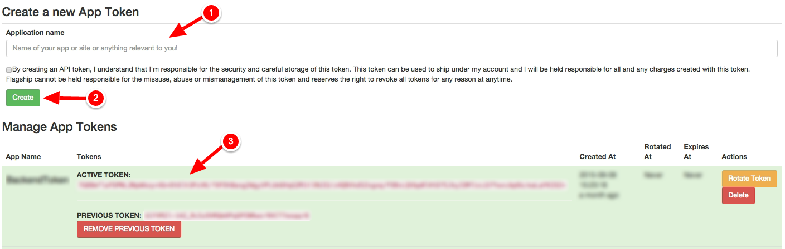
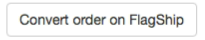
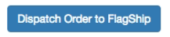
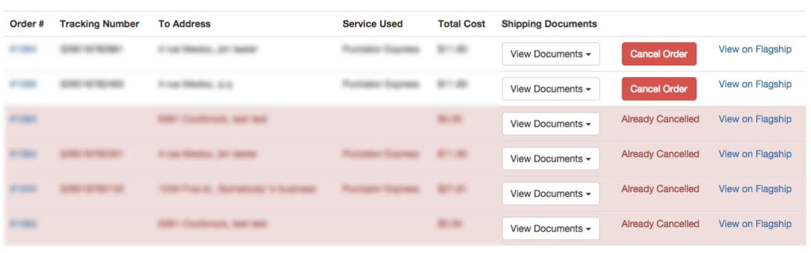

# Flagship for Shopify App (BETA)

- [About the Flagship for Shopify App] (#about-the-flagship-for-shopify-app)
- [Features](#features)
- [Considerations](#considerations)
- [Installation](#installation) 
- [Getting Started With the Flagship for Shopify app](#getting-started-with-the-smartship-app)
- [Flagship for Shopify app settings](#smartship-app-settings)
- [Pending Orders](#smartship-pending-orders)
- [Prepared Orders](#smartship-prepared-orders)
- [Schedule Pickups](#schedule-pickups)
- [Pickup Form](#pickup-form)
- [View Pickups](#view-pickups)
- [Report Issues](https://github.com/flagshipcompany/shopify-issues/issues)

##About the Flagship for Shopify App
Flagship™ for Shopify is bringing reliable discounted shipping to your online store faster, easier and more affordably.  Instantly upload data, print labels, process shipments, share real-time rates or set shipping rates on your online store - and more!  Manage shipments for online purchases easily and take your Shopify store to the next level with Flagship.

##Features
* Get real-time discounted shipping rates from Flagship's online shipping system to your Shopify store.
* Print your labels from the app.
* Manage pickups from the app.
* Split the shipment in several boxes depending on weight.
* Push any order to Flagship's online shipping system to create a prequoted shipment (useful if you don't have realtime quoting available in your Shopify Plan).
* Easy way of adding residential surcharges to the quoted price.

##Considerations
 * Only "Unlimited" Shopify plans will benefit from real time quoting. Shops with a lesser plan will still be able to offer standard and/or flat rate shipping to their online store and send shipment information to Flagship's online shipping system through the Flagship for Shopify App.
 * Since Shopify does not provide dimensions of your store goods, the shipping rate is made by weight only. Make sure you enter the dimensional weight for your goods if necessary for large but light items.

##Installation
### Install the App
#### BETA installation

To install the app place this link in your browser:
`https://shopify.smartship.io/setup`

Insert the name of your shop into the field and click the **Install** button.

You will be redirected to the Shopify installer page.

Accept the permissions it needs and you're almost done!

*NOTE: Once we're out of beta, the app will be available in the Shopify App Store*

## Connecting the app to the Flagship API

When the app is installed, you will be taken to this page where you register your token to the app.

### Create Token Credentials
Go to https://auth.smartship.io, **login with your Flagship credentials** and create a set of credentials using the Shopify Preset

*NOTE: Only Flagship Account Managers can access the credentials page*

**copy** or keep this page open, as we will need some information from this `token` that was created.

### Register your token

Insert your **Public** and **Private** keys from the token that we just created into these fields.

Submit the keys by pressing the **Save token credentials** button. If the key pair is valid, you will have successfully linked your app to the Flagship API.

You now have full access to the Flagship for Shopify app.

If for any reason, your token gets deleted, you will be redirected to this page if you ever access the app, as your token does not exist and is not considered valid. You will need to create a new token if you wish to continue using the app.

## Getting Started With the Flagship for Shopify app
Here are the menu options that can be done in the app

* **Pending Orders**
Allows you to complete orders using Flagship's online shipping system and dispatch them.
* **Prepared Orders**
Allows you to view dispatched shipments, request documents and view the shipment overview (done on the Flagship online shipping system).
* **Pickups**
Allows you to schedule pickups for dispatched shipments, view pickups and cancel scheduled pickups.
* **Settings**
Change app settings that modify quoting and shipment options when dispatching using Flagship's online shipping system.

### Flagship for Shopify App Settings

* **Services**
Checkboxes consisting of the courier services that Flagship offers, and a list of the various services types that the couriers will offer. You can use these checkboxes to show or hide certain couriers or services so that they will not appear in the *shipping method* menu at checkout.

* **Packaging**
Allows you to set a weight limit split on individual boxes in orders, meaning that if you have an order which would exceed the weight that you provided, the app adds an extra box during the quoting and dispatch processes.

* **Additional Charges**
Allows you to add a residential surcharge during the quoting process and dispatch process. This helps get more accurate rates during the quoting process and the dispatch process. You can also choose to insure orders that are made through your store with Flagship's discounted insurance program.

### Pending Orders

This is the page where you can see all the orders that have been placed by customers. 

This page also allows you to take orders and convert them to a shipment using the Flagship online shipping system. You can also automatically dispatch orders from this page as well, provided the order was quoted with a Flagship service.

Upon installing the app, it will fetch all the orders your store has not marked as shipped from the past thirty days and add them to the app's records so that you can start using the Flagship for Shopify app right away.

* **Order Number**
The order number as it appears in your Shopify admin store. Links to the overview for the order in your Shopify admin page.

* **Order Date**
The date the order was placed on.

* **Courier Used**
The courier used or the company who provides the shipping service (ex: UPS, Fedex, Purolator, etc.).

* **Service Used**
The shipping service selected by the customer.

* **Quoted Price**
The price that was displayed to the customer at the shipping method page in your storefront.

* **Is Fufilled**
Checks to see if the order has been fufilled in your admin page. An order is considered fufilled by the app when you mark the order as having been fully paid in your Shopify admin page.

#### Actions
An action that can be taken for the order, usually in the form of a button or a link. Different factors will determine what will be shown and what actions it will take.
  
* **Convert order on Flagship**

Any online store order that was processed via the Flagship for Shopify App using a standard or flat rate must be sent to the Flagship online shipping system to select your choice of service, courier rate and to complete your shipment. 
**Note**: you will not be charged for completing this action on the Flagship for Shopify App. However, when you complete your order and dispatch it through the Flagship online shipping system, you will be charged for this order.

* **Dispatch Order to Flagship**

Any online store order that was processed via the Flagship for Shopify App using live courier rates can be immediately dispatched to the Flagship online shipping system by pressing the **Dispatch Order to Flagship** button. This will automatically create the necessary documents you need to send the shipment to your customer, such as the shipping labels and the commercial invoices, if necessary. If your order has been fulfilled in your store's admin page, a prompt will appear asking you to confirm the dispatch. This extra step is for your benefit and ensures you do not dispatch an order that has already been sent out **or** so you do not get charged for an order that you do not plan on shipping.
**Note**: By dispatching an order using the Flagship for Shopify App, you will be charged for the dispatched order on the Flagship online shipping system.

* **View on Flagship**

Allows you to either see the overview for your order or continue the quoting process on the Flagship online shipping system. If your order was prequoted using the app, the link will bring you to the quote page for your order on the Flagship online shipping system. If the order was dispatched using the app, then the link will be the same, but will instead take you to the shipment overview page for the order on the Flagship online shipping system.

### Prepared Orders
This allows you to see all the orders you have dispatched using the Flagship for Shopify app and online system.

* **Order Number**
The order number as it appears in your Shopify admin store. Links to the overview for the order in your Shopify admin page.

* **Tracking Number**
The tracking number for the order.

* **To Address**
The destination of the order, as well as its intended receiver, either a company name or the name of a person.

* **Service Used**
The service that was used when the order was dispatched. 

* **Total Cost**
The total cost that was quoted when the order was dispatched.

* **Shipping Documents**

The list of shipping documents that are required when dispatching your order to the couriers. Every dispatched shipment will link to a regular sized label and a thermal label. A label must be placed on each of the packages in your shipment. For international shipments, there is a commercial invoice document that must also be included in the shipment along with the shipping labels. All the documents are in .PDF format.

* **View On Flagship**
Brings you to the overview page for the shipment on the Flagship online shipping system.

###Pickups
This link will bring you to the pickup actions page. From here, you can navigate to the **Schedule Pickups** page, or the **View Pickups** page.

####Schedule Pickups
From this page, you can schedule pickups for the shipments made through the Flagship for Shopify app.

* **Tracking Number**
The tracking number for the order.

* **Intended Destination Address**
The destination of the order, as well as its intended receiver, either a company name or the name of a person.

* **Courier**
The courier company which was used in the dispatch.

* **Shipment Date**
The date on which the shipment was made.

* **Check To Schedule**
Checkboxes for which you want to schedule pickups for. You can schedule a single pickup for multiple shipments, provided they are all from the same courier. If the couriers are all the same for the selected shipments, you can then proceed to the schedule pickup page by pressing the **Schedule pickups** button on the bottom right of the page.

####Pickup Form
This is where you fill in the information for your pickup. All of the fields are required to schedule your pickup.

* **Pickup address**
This is the address that will be used for the pickup address. This is your store's address information.

* **Pickup Date**
The date when you want to schedule the pickup. Note that all the couriers have different lengths for which you can schedule your pickups ahead of time. In most case, scheduling pickups more than a week ahead of time may result in the request failing.

* **Pickup Location**
A drop down list of pickup locations that are considered valid options by the courier.

* **Delivery Instructions**
Special instructions to the driver for how to handle your shipment or other relevant information.

Once all the information has been filled in, you can proceed by pressing the **Schedule** button. Once that has been done and no errors occur, your pickup is created and you can now view it from the **View Pickups** page.

####View Pickups
This is where you can view all the pickups you have made through the Flagship for Shopify app. You can also cancel pickups you have already made.

* **Confirmation number**
The pickup confirmation number.

* **Pickup Date**
The date when the pickup was made for.

* **Pickup Location**
The location that was provided when the pickup was scheduled.

The next row can have a button that allows you to cancel the pickup, provided that either the shipment has not been picked up by the courier yet, or that the pickup date has not been passed.

Cancelled pickups will have the row highlighted in red and the cancel button is removed.
